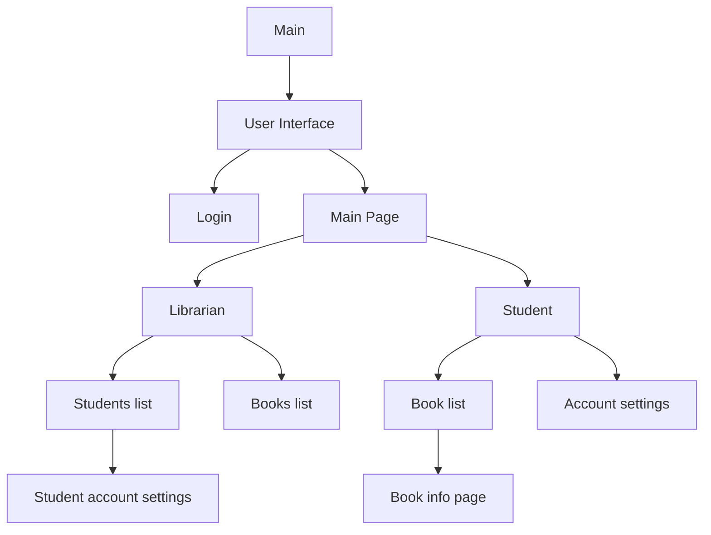

# LibrarySysyem

## Class dependency graph

```mermaid
graph TD
    A[Main]-->B[User Interface]
    B-->C[Login]
    B-->D[Main Page]
    D-->E[Librarian]
    D-->F[Student]
    E-->G[Students list]
    E-->H[Books list]
    F-->I[Book list]
    F-->J[Account settings]
    G-->Ga[Student account settings]
    I-->Ia[Book info page]
```

