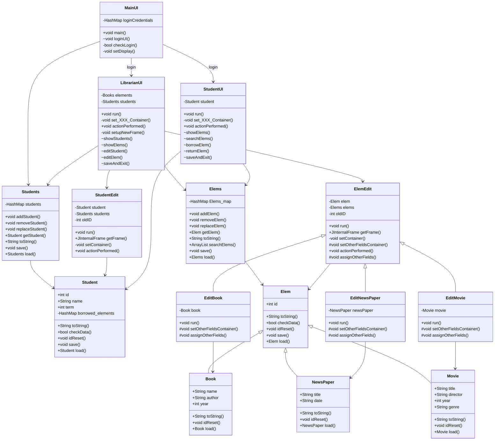

# [Library Sysyem](https://github.com/PatrykFlama/LibrarySysyem)
System for manging a university library, that can be accessed by students and librarian (administrator). Librarian can add/remove/edit books, movies, news papers and manage students. Student can rent/return books (and other), search for them. The data is stored in files.    
More features will be added  as needed.

## How it works (roughly)
Application starts from a login screen, where user can log in as librarian or student with given id. After logging in, user is presented with a main screen, where he can choose what he wants to do. Librarian has options to add/remove/edit/list books, movies, news papers (refered later as elements) and manage students. Student can rent/return elements, search for them. The data is stored in files.  
By default new created studens has assigned id and empty password. Librarian to login has to use **librarian** as username and password.

## How to run
Tested on Windows 11 with Java 20 2023-03-21 (build 20+36-2344) 64-bit.  
To run compile all .java files and run Main class. Other way is to simply run bash script `run.sh`.

## Class dependency graph
\+ for public   
\- for private    
\# for protected  
\* for static  
\~ for UI functionallity

___

## In-depth documentation
[Documentation](./doc/) generated with [Doxygen](https://www.doxygen.nl/index.html) and [Graphviz](https://graphviz.org/).

## Classes functionality
### MainUI
Main class, that starts the application. It is responsible for login screen and choosing what type of user is logging in. It also stores login credentials for librarian and students.

### LibrarianUI
Class that is responsible for librarian user interface. It is responsible for creating and managing other UI classes. It also stores data about students and elements.

### StudentUI
Class that is responsible for student user interface. It is responsible for creating and managing other UI classes. It also stores data about student.

### Students
Class that stores data about students. It is responsible for adding, removing, replacing students. It also stores data in a file.

### Student
Class that stores data about student. It is responsible for checking if data is correct, saving and loading data.

### StudentEdit
Class that is responsible for editing student data. It is responsible for creating and managing other UI classes.

### Elems
Class that stores data about elements. It is responsible for adding, removing, replacing elements. It also stores data in a file.

### Elem
Class that stores data about element. It is responsible for checking if data is correct, saving and loading data.

### Book
Class that stores data about book. It is responsible for checking if data is correct, saving and loading data.

### NewsPaper
Class that stores data about news paper. It is responsible for checking if data is correct, saving and loading data.

### Movie
Class that stores data about movie. It is responsible for checking if data is correct, saving and loading data.

### ElemEdit
Class that is responsible for editing element data. It is responsible for creating and managing other UI classes.

### EditBook
Class that is responsible for editing book data. It is responsible for creating and managing other UI classes.

### EditMovie
Class that is responsible for editing movie data. It is responsible for creating and managing other UI classes.

### EditNewsPaper
Class that is responsible for editing news paper data. It is responsible for creating and managing other UI classes.

## How to generate example data
To test programm and see its functionality uncomment `regenTestData()` line in MainUI - that will generate example test data on program launch. By default students have no password, and librarian to login has to use _librarian_ as username and password.
