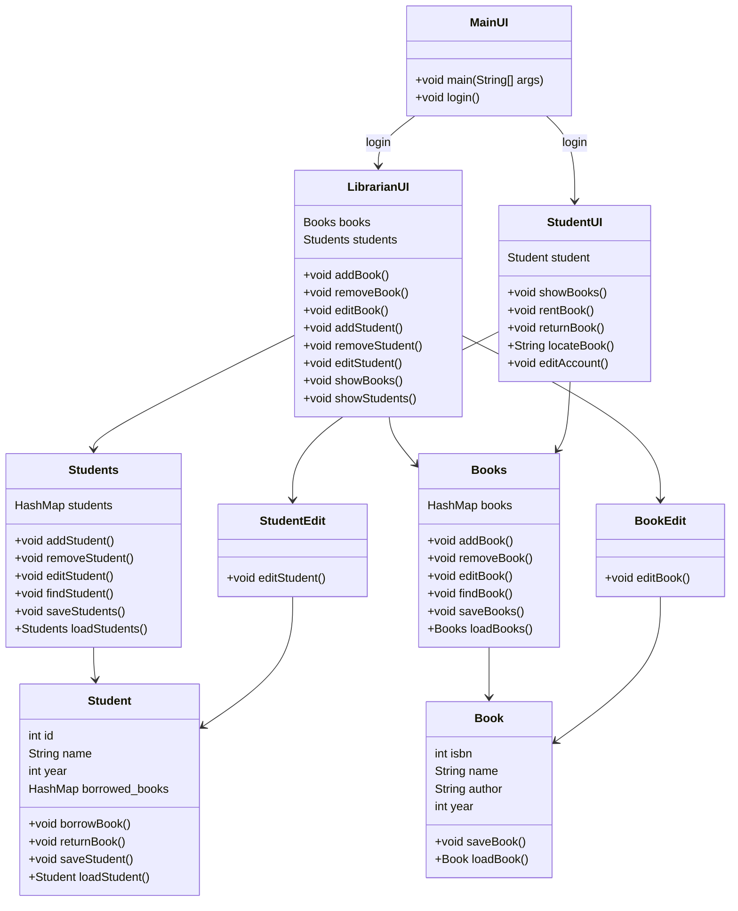

# LibrarySysyem
desc
<!-- TODO ## Description -->

## Class dependency graph

## Stuff
### Wymagania
Przynajmniej siedem zaimplementowanych nietrywialnych klas (Zawierające przynajmniej jedno pole oraz jedną metodę)

### Co się składa na projekt
* Przedstawienie analizy obiektowej za pomocą diagramu klas (UML).
* Analiza obiektowa (pisemnie)
    * spis klas, które implementuje program wraz z jednoakapitowym opisem roli klasy w systemie (może być wygenerowane automatem typu Doxygen)
    * diagram klas (UML)
    * użyte wzorce projektowe
* pliki źródłowe
* wersja skompilowana

### Terminy
* 16 maja - opis projektu, diagram UML (np w Visual Paradigm)
* 20 czerwca - pliki źródłowe, wersja skompilowana, wygenerowana dokumentacja, wskazanie wzorców projektowych

https://www.lucidchart.com/pages/pl/czym-jest-uml-unified-modeling-language