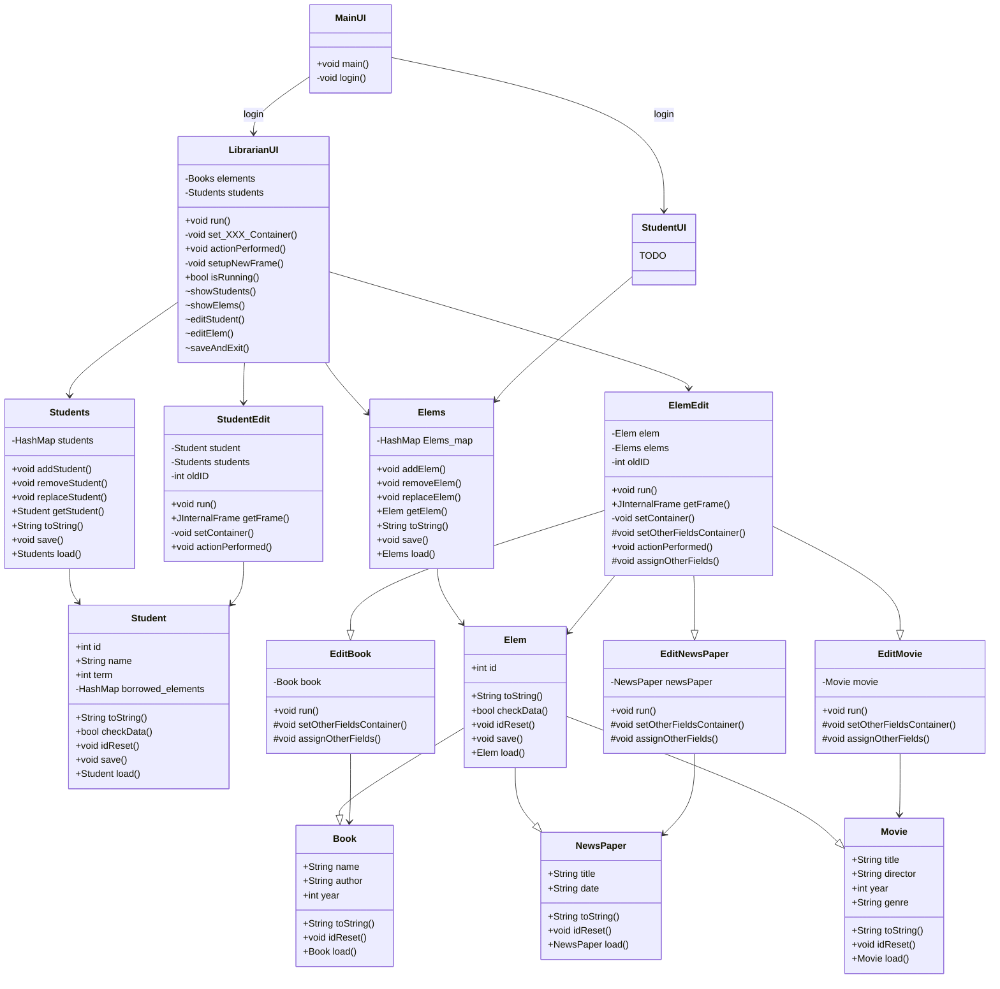

# [Library Sysyem](https://github.com/PatrykFlama/LibrarySysyem)
System for manging a university library. smth smth smth. blah blah blah.  
How it works:  
User can log in as librarian or as student.  
Librarian can add/remove/edit books, movies, NewsPapers, other library stuff and students.  
Student can rent/return books (and other), search for them and manage his account.  
More features will be added as needed.  

## Class dependency graph
\+ for public   
\- for private    
\# for protected  
\* for static  
\~ for UI functionallity

___
## TODO
* add time
* create elements,students in ui
___
## Stuff
### Wymagania
Przynajmniej siedem zaimplementowanych nietrywialnych klas (Zawierające przynajmniej jedno pole oraz jedną metodę)

### Co się składa na projekt
* Przedstawienie analizy obiektowej za pomocą diagramu klas (UML).
* Analiza obiektowa (pisemnie)
    * spis klas, które implementuje program wraz z jednoakapitowym opisem roli klasy w systemie (może być wygenerowane automatem typu Doxygen)
    * diagram klas (UML)
    * użyte wzorce projektowe
* pliki źródłowe
* wersja skompilowana

### Terminy
* 16 maja - opis projektu, diagram UML
* 20 czerwca - pliki źródłowe, wersja skompilowana, wygenerowana dokumentacja, wskazanie wzorców projektowych

https://www.lucidchart.com/pages/uml-class-diagram

# Projekt końcowy
## Składowe projektu
* własny pomysł na program ;)
* opis projektu (1-2 akapity)+ diagram klas utworzony przed rozpoczęciem implementacji;
* prezentacja pomysłu wraz z diagramem klas podczas pracowni (5 pkt)
* pliki źródłowe i skompilowane (10 pkt);
* dokumentacja zawierająca: spis klas wraz z opisem (5 pkt).

## Co z tym zrobić

Swój pomysł na projekt i diagram klas prezentujecie podczas zajęć. Zwykle wystarcza ok 15-20 min. Termin ustalacie z prowadzącym pracownię.  
Dodatkowo opis projektu wraz z diagramem przesyłacie na SKOS  
Zrealizowany projekt (pliki źródłowe, dokumentacja, aktualny diagram klas) wysyłacie na SKOS. Prowadzący może ustalić własne zasady odbioru projektów.  

## Jak to zrobić

ad. 1  
Można skorzystać z zamieszczonych pomysłów i rozwinąć je. Można też samemu wymyślić. Nie musi to być kompletny program. Można zrealizować też jakiś kompletny fragment większej całości.

ad. 2  
Opis nie musi być długi. Narzędzie dowolne: txt, doc, odt, latex, pdf

ad. 3  
O diagramach opowiem na 11 wykładzie. Do rysowania można użyć przeglądarkowych narzędzi typu diagrams.net czy umlet.com. Dostępny jest też program Visual Paradigm oparty o środowisko Java.

ad. 4  
Język programowania dowolny (nie tylko Java, C# czy Ruby) ale ma być obiektowy. Narzędzia/IDE dowolne.

ad. 5  
można wykorzystać narzędzia do generowania dokumentacji z plików źródłowych i komentarzy.

Terminy  
**16 maja**: opis projektu i diagram (wysłanie na SKOS)

**20 czerwca**: projekt (wysłanie na SKOS)

Prezentacje: do uzgodnienia z prowadzącym pracownie

# Propozycje zadań - inspiracje
Poniższe zadania proszę potraktować jako inspiracje do wymyślenia własnych tematów projektów.

## System informacji geograficznej

Opis

System informacji geograficznej (GIS - Geographic Information System) jest to system gromadzący wszelkie dane o jakimś obszarze: ukształtowanie terenu, właściciele, informacje geologiczne, zabudowania czy przebieg dróg, rur i kabli.
Zadanie

Zaprojektuj i zaimplementuj klasy reprezentujące różne obiekty geograficzne. Uwzględnij w swoim projekcie takie elementy jak 'projektowane drogi czy kable'. Dla ułatwienia można przyjąć, że granicami 'obszarów' są nieprzecinające się łamane zamknięte. Zrealizuj graficzny system wizualizacji informacji dla wskazanego fragmentu mapy (dla ułatwienia wybrany fragment może mieć kształt prostokąta). Przyjmij, że możliwe jest dowolne wybieranie elementów, jakie mają się znaleźć na mapie.
Inne informacje

Dane mogą być przechowywane w zwykłym pliku tekstowym. W realizacji należy uwzględnić przynajmniej jakieś proste odwzorowanie ukształtowanie terenu (bez rzek itp.), budynki i drogi. Jako wizualizacja wystarcza zwykły rzut na płaszczyznę.

## Planowanie budżetu

Opis

Przy planowaniu budżetu (choćby nawet domowego) zbiera się dane o przewidywanych dochodach i wydatkach wraz z przewidywanymi terminami wpływów pieniędzy i płatnościami. Płatności zwykle dzieli się na rodzaje, które w jakiś sposób odpowiadają ich ważności (zwykle wpierw płaci się rachunki za prąd i telefon, a jak coś zostanie, to można pójść za resztę do kina). Zazwyczaj jednak faktyczne wpływy i płatności różnią się od planowanych. Co więcej, mogą się pojawić nieprzewidziane wpływy lub wydatki. W przypadku bardziej skomplikowanych budżetów panowanie nad wszystkim może być poważnym problemem.

Zadanie
Zadanie polega na napisaniu programu wspomagającego panowanie nad budżetem. Podstawowe zadania programu to:

pamiętanie przewidywanych dochodów i płatności wraz z terminami;  
gromadzenie danych o faktycznych dochodach i płatnościach, oraz kojarzenie ich z dochodami i płatnościami planowanymi;  
podział dochodów i płatności na kategorie  
analiza planu, czy w jakimś momencie planowane wydatki nie przekraczają wpływów;  
obliczanie bilansu planowanego i faktycznego na wskazany dzień  
ostrzeganie o przekroczeniu budżetu w jakiejś kategorii.  

Dane

Można przyjąć, że dane są pamiętane w pliku (lub plikach) tekstowym o ustalonym formacie.

## Labirynt
Wstęp

Zadaniem jest napisać program symulujący w bardzo uproszczony sposób gry polegające na poruszaniu się po tajemniczych labiryntach, zbieraniu skarbów itp. Aby tego dokonać, muszą zostać zdefiniowane podziemia. Podziemia składają się z komnat, z których można przez przejścia przechodzić do następnych komnat. Specjalnym rodzajem przejść są drzwi, przez które można przechodzić w dwie strony. Do drzwi jest jednak potrzebny odpowiedni klucz, aby je otworzyć. W komnatach mogą się znajdować różne rzeczy, np. klucze lub skarby. Użytkownik może poruszać się po komnatach wydając w trybie interakcyjnym polecenia:

przejdź "przejście"  
otwórz "drzwi"  
zamknij "drzwi"  
rozejrzyj się - opisuje komnatę oraz podaje, jakie są w komnacie przedmioty  
oraz stworzenia;  
sprawdź "przedmiot" - podaje dokładny opis przedmiotu;  
weź "przedmiot"  
połóż "przedmiot"  
koniec  

Dodatkowo po podziemiach mogą się błąkać w sposób losowy różne stwory. Dla uproszczenia przyjmijmy, że są to złodzieje, którzy mogą nam ukraść jeden posiadany przedmiot, jeśli go spotkamy w komnacie.

## Gry planszowe
Wstęp

Zadanie polega na implementacji gry planszowej. Przykłady różnych gier można znaleźć np. na portalu https://www.zasadygry.pl.